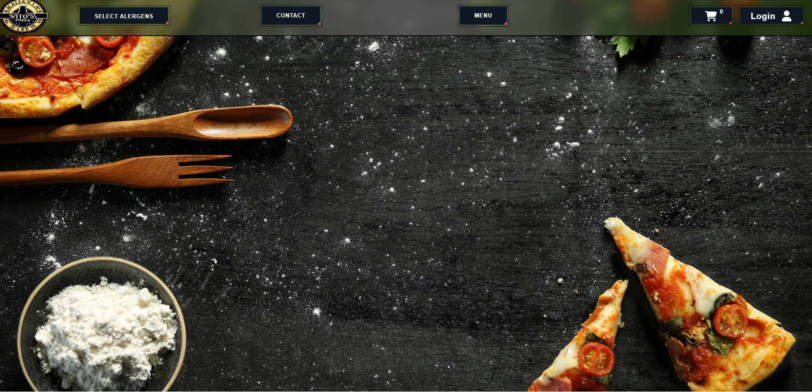
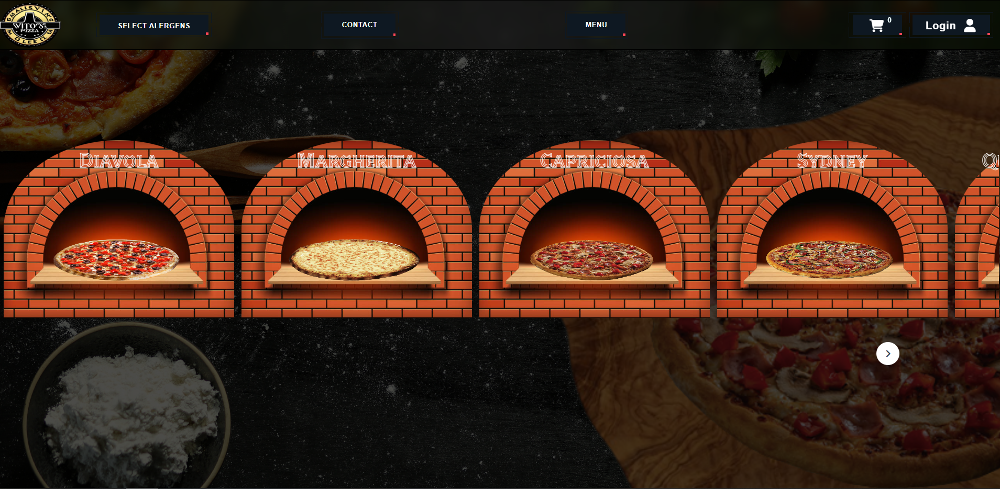

# Pizza-Prototype

## Project Description

 Our project represents a Pizza website. We have a Login option, used to save the orders in our database. We also have a MENU button which shows every pizza that we have on the menu, a CONTACT button, which provides us with a form to complete, to help users file their complains to us. Moreover, we have the posibility to filter the pizzas on the menu by certain allergens. When the user selects all the pizzas he wants to buy, he can add them to the cart and then place an order.

 
 

### Technologies Used

We utilized the following technologies:

- **Express.js**: Backend development.
- **Bootstrap**: Responsive styling.
- **CSS**: Custom styling.
- **HTML**: Creating web elements.

### Challenges

Challenges faced during development:

- Navigating between pages without using routing.
- Finding a suitable design.

### Future Plans

Our plans for the future:

- Adding an option to create custom pizzas.
- Improve the design.

## Setup

### Backend Setup:

1. **Install Dependencies:**

   - Navigate to the `server` directory in your terminal.
   - Run: `npm install` or `pnpm install`.

2. **Run the Server:**

   - Run: `npm run start` to start the server.

### Frontend Setup:

1. **Prerequisites:**

   - Ensure Node.js is installed and properly configured.

### How to use

1. **LOGIN**
   - Simply click the Login button and fill in your information.

2. **SELECT ITEMS**
   - Click on the MENU button, and choose any pizza you would like to order.
   - Optionally filter the menu by using the Select Alergens button.
   - Add the pizzas to the cart.

3. **CHECKOUT**
   - Click on the Cart Icon and then click the Checkout button.

## Code Contributors

- Bogdan Diaconu: [GitHub Profile](https://github.com/bogdandiaconupv)
- Paul Costea: [GitHub Profile](https://github.com/Paaul2121)
- Iacob Oliver: [GitHub Profile](https://github.com/IacobOliver)
